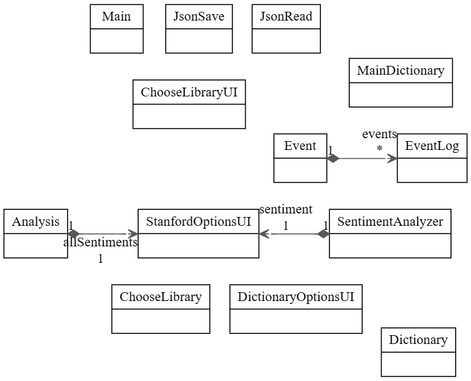

# Sentiment Analysis Bot using Java


## What will the application do?
The sentiment analysis bot will **analyze and classify** the sentiment of a given text as positive, negative or neutral using natural language processing (NLP) and machine learning algorithms. It will be able to handle a large volume of text data, process it efficiently and provide results in real-time. The user-friendly interface will allow users to quickly and easily analyze text data with just a few clicks.

## Who will use it?
The target audience for the sentiment analysis bot are businesses, organizations, and individuals who need to analyze and understand the sentiment expressed in large volumes of text data.

For businesses, this application can be used to gain insights into customer opinions, feedback and sentiments towards their products or services, which can be used to improve customer experiences and make informed business decisions.

For organizations, this can be used to monitor public sentiment towards specific topics, issues, or events. And for individuals, this can be used to analyze the sentiment expressed in their own writing or the writing of others.

## Why is this project of interest to you?
This project is of interest to me because sentiment analysis is a rapidly growing field with a multitude of potential applications, and the ability to create an effective sentiment analysis system could lead to a better understanding of public opinion and could be used to improve customer experiences and business decisions. Additionally, developing such a bot in Java will further my skills and knowledge in programming and machine learning.

## User Stories

- As a user, I want to be able to input text and receive a sentiment analysis of that text.
- As a user, I want to be able to add results to a list of previous results, for future reference.
- As a user, I want to be able to remove the previous result.
- As a user, I want to be able to correct an analysis if I feel the bot is wrong.
- As a user, I want to be able to export my results to a JSON file, so I can use them in other applications or share them with others.
- As a user, I want to be able to view the sentiment analysis results in a graphical representation, such as a bar chart or pie chart.

# Instructions for Grader

- You can generate the first required event related to adding Xs to a Y by:
  - Choosing the Stanford NLP Library button on the home screen.
  - Run the bot on your own statement using the first button labelled "Run the bot on your own statement".
  - Add the input to the list using the button "Add input to list".
- You can locate my visual component by:
  - Choosing the Dictionary option on the home screen
  - Load previous results from the sample JSON file provided using the "Load previous results" button.
  - Then click the "View Sentiment Analysis Results" button, revealing a graph showing count of how many positive, negative and unknown sentiments are present in the list. 
- You can save the state of my application by:
  - Choosing the Dictionary option on the home screen
  - Either Load previous results from the sample JSON file provided using the "Load previous results" button or put your own statements.
  - Save the data to a JSON file by pressing the "Save previous results" button.

- You can reload the state of my application by:
  - Choosing the Dictionary option on the home screen
  - Load previous results from the sample JSON file provided using the "Load previous results" button.

# Phase 4: Task 2

```shell
Wed Apr 12 00:39:00 PDT 2023
Sentiment Analysis ran on statement
Wed Apr 12 00:39:00 PDT 2023
getStatement called
Wed Apr 12 00:39:00 PDT 2023
getSentiment called
Wed Apr 12 00:39:03 PDT 2023
Sentiment added to Analysis
```




# Phase 4: Task 3

If I had more time to work on the project, I would consider the following changes to improve the design:

- Introduce abstract classes and interfaces instead of the current way of just copying pieces of code.

- Refactoring the code into smaller, more focused classes that have a single responsibility, making the code more modular.

- Rewrite the code in a more readable way, making it easier to understand.

By making these changes, I would be able to improve the code's maintainability and scalability, while also reducing the likelihood of bugs and making the code easier to understand and work with.